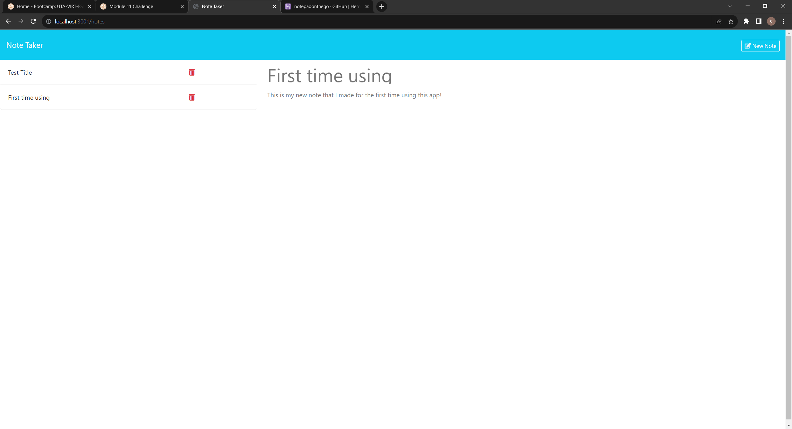

# notepadonthego

## Description

notepadonthego is an app that allows you to take notes wherever you are and store them for later viewing.

## Table of Contents

- [Installation](#installation)
- [Usage](#usage)
- [Credits](#credits)
- [License](#license)
- [Questions](#questions)

## Installation

This app is deployed on heroku and can be used instantly without a download.

## Usage

You can use the app by typing in a note with a title and saving for future use.

## Credits

github starter code was provided in class

##License

This project is licensed under the [MIT License](http://choosealicense.com/licenses/mit/) license.

##Questions

For questions about this project, please contact:
- GitHub: [@chrisllanos](https://github.com/chrisllanos)
- Deployed Application Link: 
- GitHub Repository: https://github.com/chrisllanos/notepadonthego

